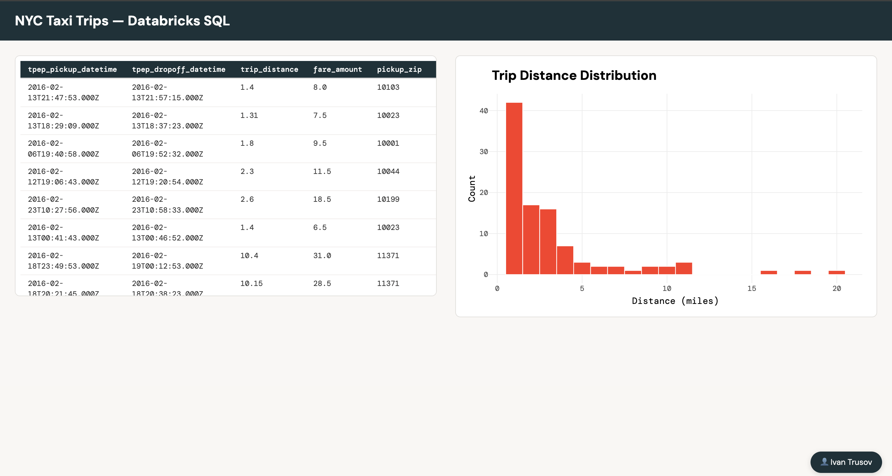

# 📊 Shiny for R on Databricks Apps

A sample [Shiny](https://shiny.posit.co/) app written in **R** that runs natively on [Databricks Apps](https://docs.databricks.com/en/apps/index.html) — deployed via DABs (Databricks Asset Bundles).



## 🤔 Why is this interesting?

Databricks Apps instances are shipped with **Python and `uv`**, but unfortunately doesn't have a preinstalled R runtime. 

This project shows how to use a lightweight Python launcher that bootstraps an R environment at startup using [micromamba](https://mamba.readthedocs.io/en/latest/user_guide/micromamba.html), then hands off execution to a Shiny app.

## 🏗️ How it works

```
Databricks App Instance
=========================

uv run scripts/launcher.py
  |-- 1. Downloads micromamba
  |-- 2. Creates conda env from environment.yml
  |-- 3. Installs R + packages
  '-- 4. Starts Shiny app via Rscript

app/app.R  -->  serves on $DATABRICKS_APP_PORT
```

The Shiny app queries **Databricks SQL** using the forwarded user token (`HTTP_X_FORWARDED_ACCESS_TOKEN`), so each user sees data scoped to their own permissions.

## 📁 Project structure

```
├── app/
│   └── app.R                # Shiny app (UI + server)
├── scripts/
│   └── launcher.py          # Python bootstrap script
├── environment.yml          # Conda env: R + packages
└── databricks.yml           # DABs bundle definition
```

## ✅ Prerequisites

- [Databricks CLI](https://docs.databricks.com/en/dev-tools/cli/install.html) installed and authenticated
- A Databricks SQL Warehouse ID
- Access to a Databricks workspace

## 🚀 Deploy

**1. Validate the bundle**

```bash
databricks bundle validate
```

**2. Deploy to your workspace**

```bash
databricks bundle deploy -var="sql_warehouse_id=<YOUR_WAREHOUSE_ID>"
```

**3. Launch the app**

```bash
databricks bundle run shiny-app-r
```

That's it — the app will be live on your workspace's Apps URL. 🎉

## 🔧 Configuration

The bundle is defined in `databricks.yml`. Key settings:

| Setting         | Value                                                     |
| --------------- | --------------------------------------------------------- |
| App name        | `shiny-app-r`                                             |
| Start command   | `uv run scripts/launcher.py`                              |
| User API scopes | `sql`                                                     |
| Variable        | `sql_warehouse_id` — passed as `SQL_WAREHOUSE_ID` env var |

R dependencies live in `environment.yml` and are installed at container startup via micromamba.

## 🔑 Authentication

Databricks Apps handle auth automatically. The app reads the user's token from the `X-Forwarded-Access-Token` header injected by the Apps proxy — no secrets management needed.

## 💡 Adapting this for your own Shiny app

1. Replace `app/app.R` with your Shiny application
2. Add any new R packages to `environment.yml`
3. Update the SQL query or data source as needed
4. Re-deploy with `databricks bundle deploy`

## 📚 References

- [Databricks Apps](https://docs.databricks.com/en/apps/index.html)
- [micromamba](https://mamba.readthedocs.io/en/latest/user_guide/micromamba.html)
- [Shiny](https://shiny.posit.co/)
- [R](https://www.r-project.org/)
- [uv](https://docs.astral.sh/uv/)